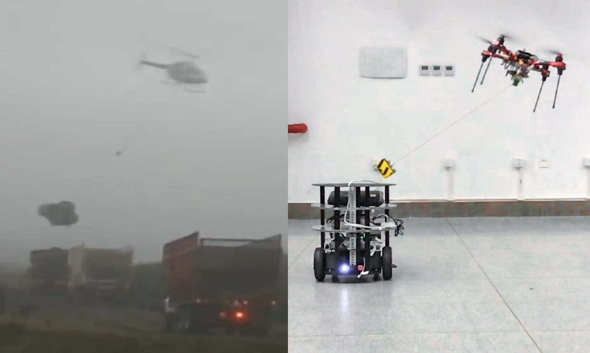

# visual_encoder_estimator

# Abstract

Autonomous delivery of suspended payloads with MAVs has many applications in rescue and logistics transportation. Robust and on-line estimation of the payload status is important but challenging especially in outdoor environments. The paper develops a novel real-time system for estimating the payload position; the system consists of a monocular fish-eye camera and a novel encoder-based device. A Gaussian fusion-based estimation algorithm is developed to obtain the payload state estimation. Based on the robust payload position estimation, a payload controller is presented to ensure the reliable tracking performance on aggressive trajectories. Several experiments are performed to validate the high performance of the proposed method.

* code and design: may be released soon.

* paper: [Vision-encoder-based Payload State Estimation for Autonomous MAV
  With a Suspended Payload](./paper/ren2021.pdf).

